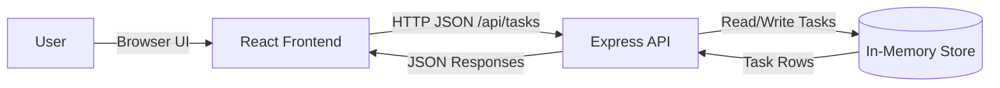
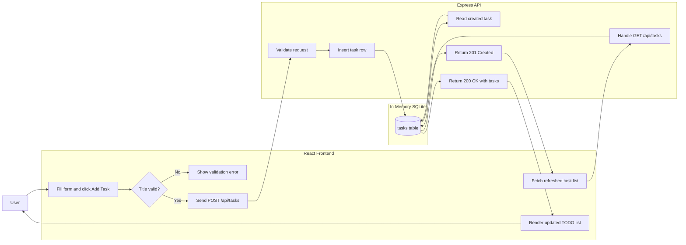

# Cloud Architecture Overview

This monorepo runs as a simple single-environment system with:
- A React frontend for task management UI
- An Express API for task CRUD operations
- An in-memory SQLite store for runtime task persistence

## System Context Diagram



### Text Diagram (Fallback)

```text
+--------+        Browser UI        +----------------+      /api/tasks      +--------------+
|  User  | -----------------------> | React Frontend | -------------------> | Express API  |
+--------+                          +----------------+                      +------+-------+
                                                                               | Read/Write |
                                                                               v            |
                                                                         +------------------+
                                                                         | In-Memory Store  |
                                                                         |  SQLite (:memory:)|
                                                                         +------------------+
```

## Create TODO Flow Diagram



## Notes

- The frontend and backend are developed in the same monorepo.
- The backend uses in-memory storage, so data resets when the process restarts.
- No external cloud database or third-party storage service is part of this architecture.
